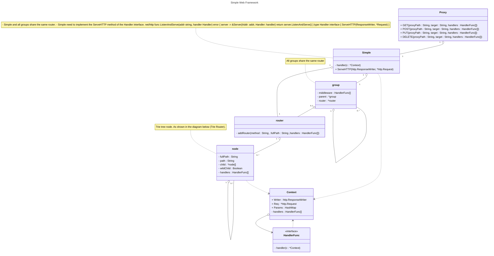

```mermaid
---
title: Simple Web Framework 
---
classDiagram

    class Proxy{
        + GET(proxyPath : String, target : String, handlers : HandlerFunc[])
        + POST(proxyPath : String, target : String, handlers : HandlerFunc[])
        + PUT(proxyPath : String, target : String, handlers : HandlerFunc[])
        + DELETE(proxyPath : String, target : String, handlers : HandlerFunc[])
    }

    note for Simple"

        - Simple and all groups share the same router.

        - Simple need to implement the ServeHTTP method of the Handler interface.

        net/http

            func ListenAndServe(addr string, handler Handler) error {
                server := &Server{Addr: addr, Handler: handler}
                return server.ListenAndServe()
            }

            type Handler interface {
                ServeHTTP(ResponseWriter, *Request)
            }

    "

    class Simple{
        - handler(c : *Context)
        + ServeHTTP(http.ResponseWriter, *http.Request)
    }

    note for group "
    All groups share the same router
    "

    class group{
        - middleware : HandlerFunc[]
        - parent : *group
        - router : *router
    }
    
    class router{
        - addRouter(method : String , fullPath : String ,handlers : HandlerFunc[])
    }

    note for node "
        Trie tree node.
        As shown in the diagram below (Trie Router).
    "

    class node{
        - fullPath : String
        - path : String
        - child : *node[]
        - wildChild : Boolean
        - handlers : HandlerFunc[]
    }

    class Context{
        + Writer : http.ResponseWriter
        + Req : *http.Request 
        + Params : HashMap<String,String>
        - handlers : HandlerFunc[]
    }

    class HandlerFunc{
        <<interface>> 
        - handler(c : *Context)
    }

    Proxy "1" o-- "1" Simple
    Simple "1" o-- "1" group 
    Simple "1" o-- "1" router 
    group "1" o-- "0..*" group
    node "1" o-- "0..*" node
    group "0..1" o-- "1*" router
    router "1" o-- "0..*" node
    node ..> Context
    Simple ..> Context
    Context o--> HandlerFunc
    HandlerFunc ..> Context
```
